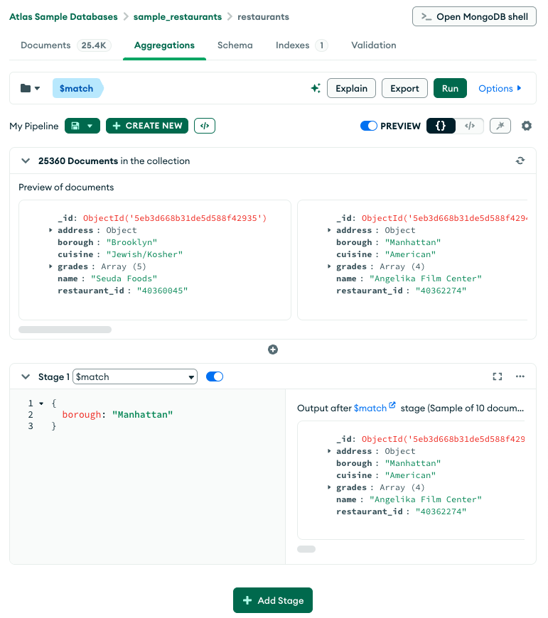
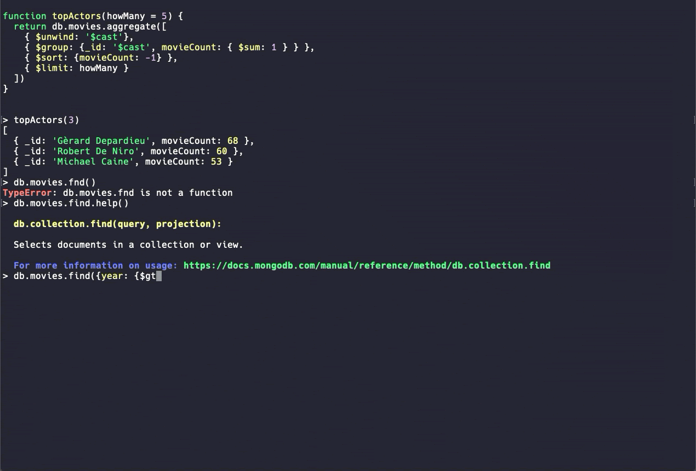

postgresql - pgadmin(gui) and psql(command line interface and terminal)
 

 -> same as mongodb - compass and shell
  
 

# psql: 
- terminal interface to mannage postgresql database
- text based command only 